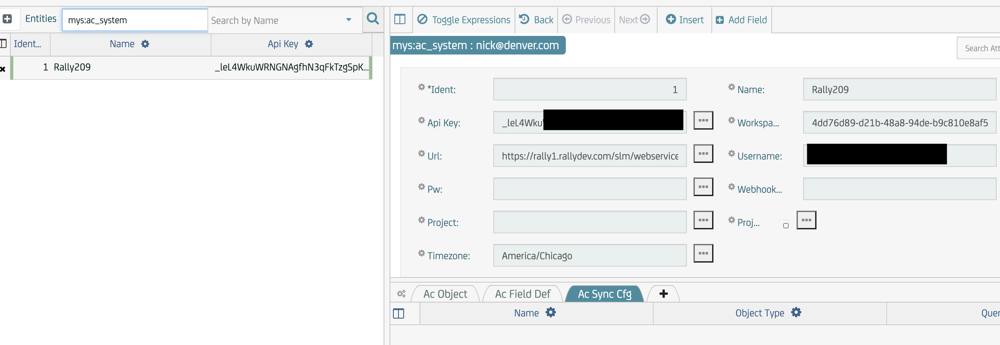
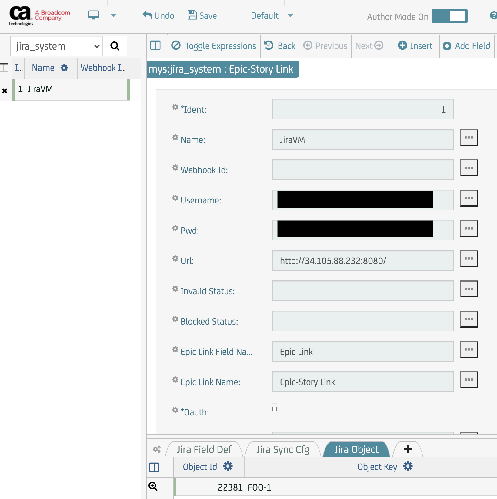
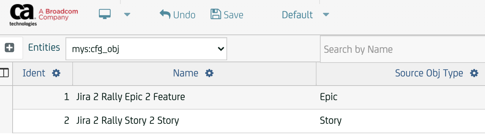
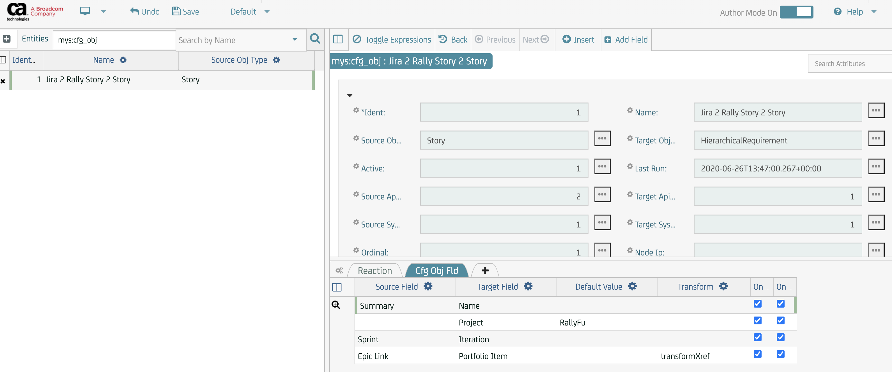
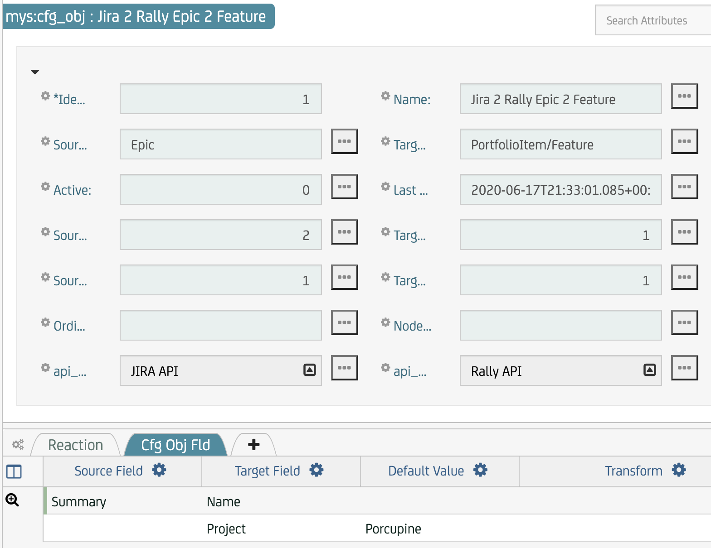
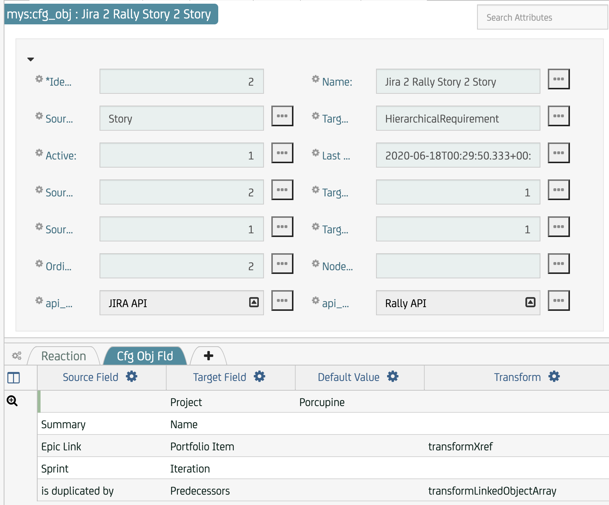
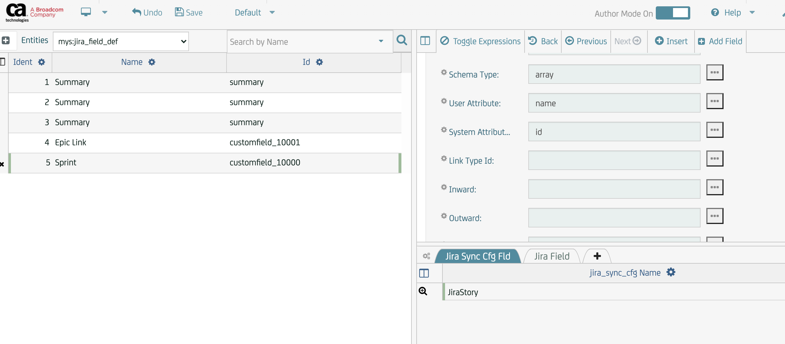
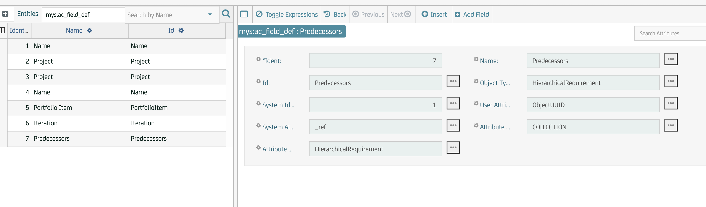

# lac-manual-setup

## two flows in Jira to Rally direction

### `ac_system` table  

### `jira_system` table  

### `cfg_obj` table  
The names of flows are arbitrary, make them descriptive, e.g.
* Jira 2 Rally Epic 2 Feature 
* Jira 2 Rally Story 2 Story

### insert fields
This is how this page looks like with both left and right frame when we add entries to `Cfg Obj Fld` on the bottom right.  

This has to be done for both flows.
### Epic/Feature field mapping  

### Story/HierarchicalRequirement field mapping  

### `jira_sync_config` table
Jira is the source sysetm in this configuration, so `jira_sync_config` has to be configured. Here is a screenshot for configuring Story related entries:  

Here is how `jira_field_def` looked like before I added is `duplicated by` field.  All these entries were propagated automatically: this table was not configured manually.  

Specific to mapping of Jira's field (e.g. `duplicated by`) to Rally's `Predecessors` (don't pay attention to mismatch of duplicated to predecessor - this is just an example) an extra step is required. Attribute Type Def (`attribute_type_def`) in `ac_field_def `table has to be modified. It has to say "HiererchicalRequirement" only:  

